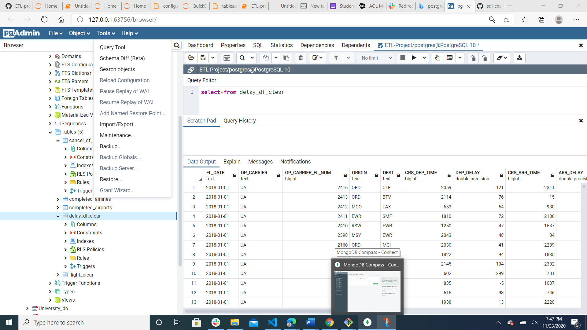
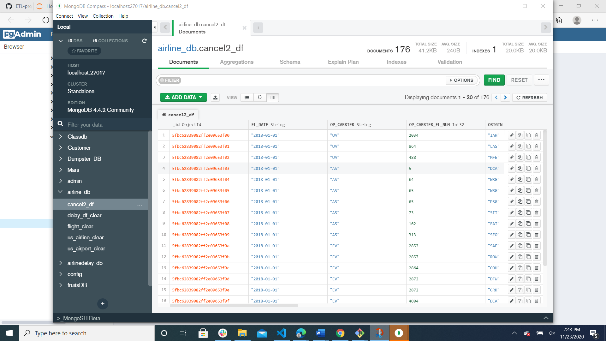

# ETL-project Technical Report

## Flight Delays and Cancellations

Group members: Wei Zhu , Irene Okada

### Data Source:

Our data focus was on flight delays and cancellations. Specifically, we were interested in the potential to project causes of flight delays and to predict likelihood of delay based on calendar, location, airline etc. We sourced data from Kaggle.com primarily in csv form. Although multiple years of data were available, we focused on the year 2018, the most recent full set of data. In addition, we extracted data regarding airports including codes and location. To close some gaps in data we extracted text data from a government aviation website.

_Sources included:_

- https://www.kaggle.com/gauravmehta13/airline-flight-delays?select=flights.csv
- https://www.kaggle.com/yuanyuwendymu/airline-delay-and-cancellation-data-2009-2018?select=2018.csv
- https://en.wikipedia.org/wiki/List_of_airline_codes
- https://en.wikipedia.org/wiki/List_of_airports_in_the_United_States

### Workflow was as follows:

**_Extract/Data Utilized_**
Data files (csv and webpage) were read into Jupyter notebooks using pandas.

**_Transformation_**:
The files were cleaned, and fields prioritized based on hypothetical questions we would want to answer. Some columns were dropped, some renamed, some split and the datatype was changed on some to facilitate ultimate creation of a database in SQL. Transforming the data accommodated ease of reading and manipulation of the files and allows us to save space by creating multiple tables that can be referenced or joined depending on the need and question to be answered.

- _Airports_: includes the IATA airport code, full name, address, long. and lat. of airports

- _Flight data_: includes flight delay information with delay time, airline short code and date details

- _Cancellation data_: includes the code and cause of cancellation, original origin/destination, potential flight length, month/day/year of flight among other potentially useful information

- _Delayed flight data_: includes the code and cause of delay, original origin/destination, flight length,date among other potentially useful information

**Loading**:
We then created a connection between Jupyter Notebooks and Postgres to export Data Frames and create a database. Since our data was already in .csv format we expected this could be efficient and save space. For practice and potential flexibility (and because it was easy) we also created a Mongodb with multiple collections, ready for use in queries and analysis.

_Diagrams for sql_

_Screenshot of sql query for delay table in SQL_

_Screenshot of cancel flight collection in MongoDB_

### Lessons Learned:

Understand that some databases are very large and that due to storage limitations on projects, sampling methodologies may be considered. In this case it was more efficient for us to use a sample to test our code.
